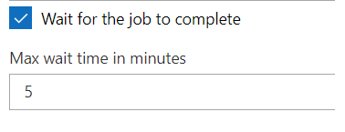
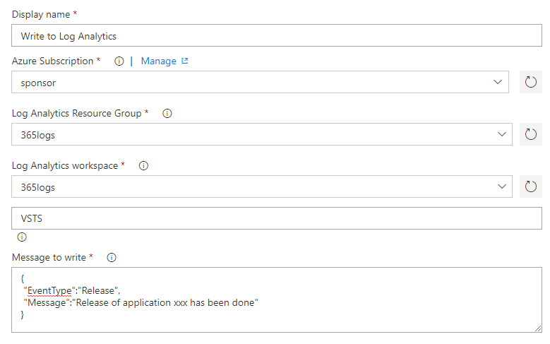

# azure-tools-extension
Full Azure API Management suite and more VSTS extension
# Disclaimer
This software is provided as-is with no warranty of any kind. The extension has been tested on the Hosted 2017 agent and on a self-hosted Windows agent.
# Azure Tools in a nutshell
The purpose of this extension is to bring some Azure Functionalities into VSTS. 
# Release Notes
## v1.0
* Integrate with Azure Automation runbooks
* Integrate with Log Analytics

# Setup prerequisite and considerations
In order to use this extension, you must have an ARM Service Endpoint configured in VSTS and make sure this endpoint is allowed to contribute to the different resources targeted by the task. Granting subscription contributor is more than enough but you may alternatively grant more granular permissions through RBAC. 

# Tasks included in the extension
## Call an Automation Runbook
This task allows you to integrate with Azure Automation. You might for instance use this task to notify about the release completion of a given application. Azure Automation runbooks are often used by infrastructure and operations to manage both on-premises and Cloud-based assets, while VSTS is typically used by application teams. This task helps bridging Dev and Ops together. The following screenshots illustrate its configuration: 

  

where you specify the target runbook to be called, whether or not the task should create a one-time webhook for the choosen runbook. The webhook payload has to be provided in JSON format. This task will of course only work with runbooks that have been designed to be webhook friendly. 
Although the on-the-fly creation of the webhook is recommended for secrecy reason, to avoid disclosing the webhook url, you can alternatively specify a webhook URL manually:  
  
In such a case, you'd better use a secret release variable to hold the value of the webhook url unlike the above screenshot which contains the actual value, for sake of explanation. 
The call to the webhook causes Azure to create a job which you can decide to wait for its completion:  
  
and specify the maximum amount of time you are willing to wait. A timeout exception will be generated in case the job does not successfully terminate within the specified time range. An error will be generated in case the job ends up in a faulty state (suspended, stopped, etc..). Note that while this option may be useful to ensure an end-to-end successfull deployment, it is also consuming release minutes and prevents other releases from being handled by the agent currently in charge. For long running runbooks, you'd better not wait for the job to complete, which in this case, will cause the task to fire & forget the job.
## Write to Log Analytics
Log Analytics becoming more and more prominent in Azure, monitoring teams start to rely on it for many different monitoring scenario. In this context, this task helps bridging Dev & Ops together by integrating with Log Analytics in order to notify monitoring teams about release-related events. 
The following screenshots illustrate its configuration: 
  
where you choose the target Log Analytics workspace and you specify the message to be written. The format of the message can be anything providing it is in JSON format and compliant with Log Analytics requirements. The task retrieves the Log Analytics secondary key on the fly, in order to hash and post the message through the opinsights API. 